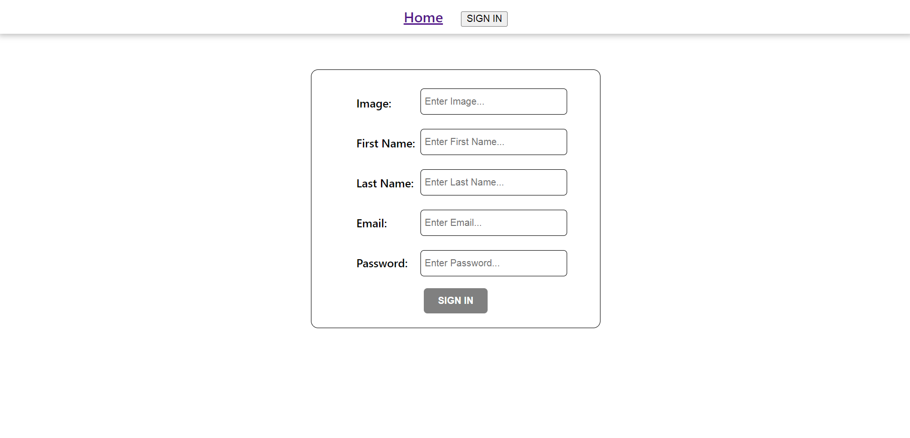
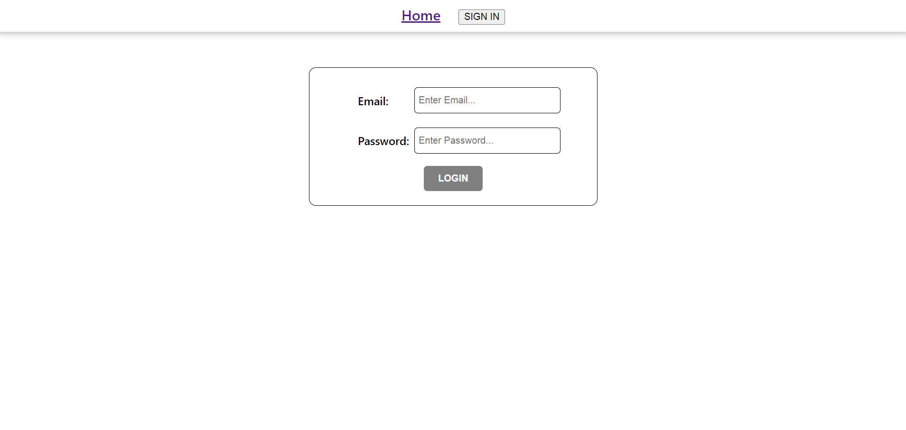
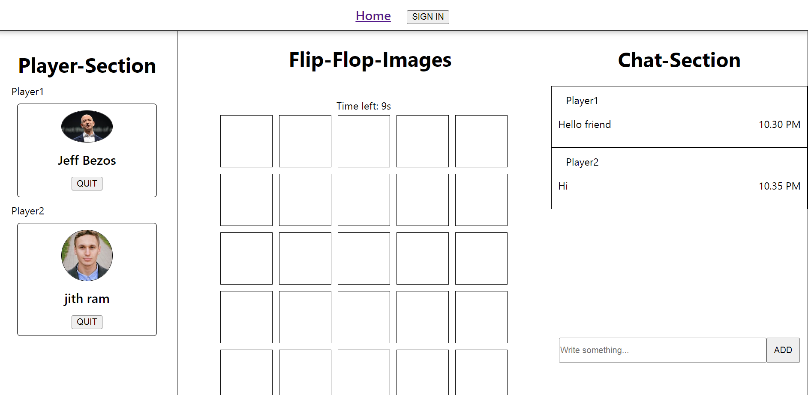
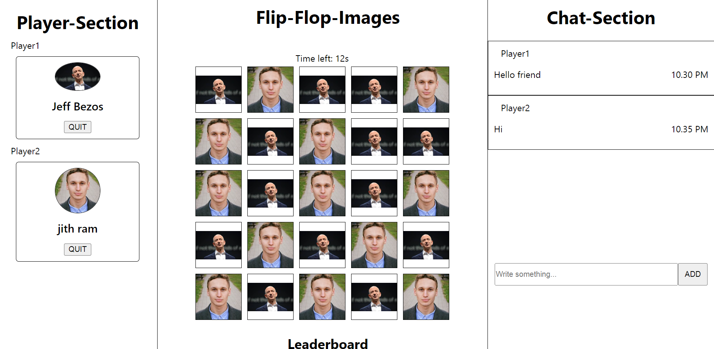
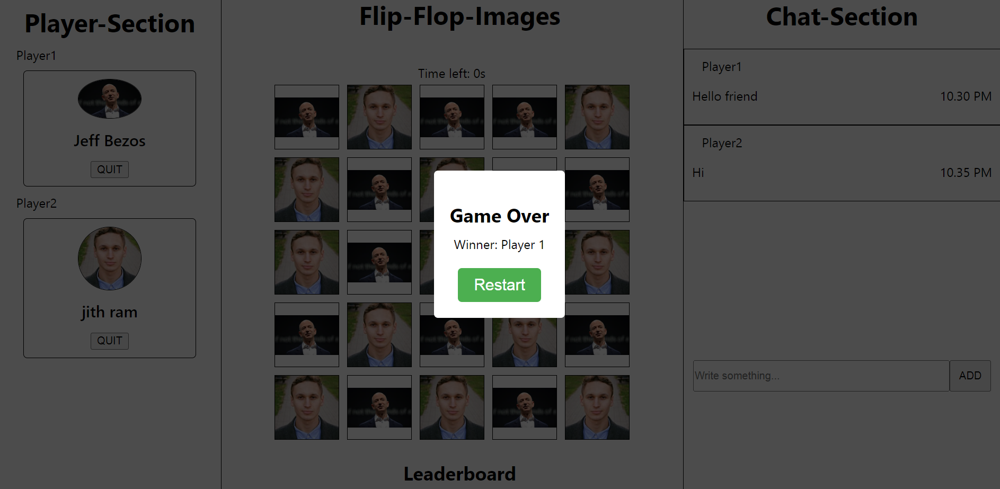

# Game-Hackathon-Project
It is the game hackathon project, where two players are playing a game. In that images of players are need to find to each particular player and winner decided on number which got high.

**To see the live site click the below link.**

`https://funny-cactus-71239a.netlify.app/`

**To see the backend, below is the backend deployed link.**

`https://hungry-vestments-cod.cyclic.app`

## Built with
<ul>
  <li>Typescript</li>
  <li>HTML</li>
  <li>CSS</li>
  <li>JavaScript</li>
</ul>

## Used libraries
<ul>
  <li>node modules</li>
  <li>Styled-Components</li>
  <li>axios</li>
  <li>React-router-dom</li>
</ul>

## Features
<ul>
  <li>Register/Login</li>
  <li>Player Dashboard</li>
  <li>Playerboard</li>
  <li>Chat Messages</li>
</ul>

## Some screenshots of the project

### Thanks for reading